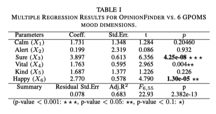
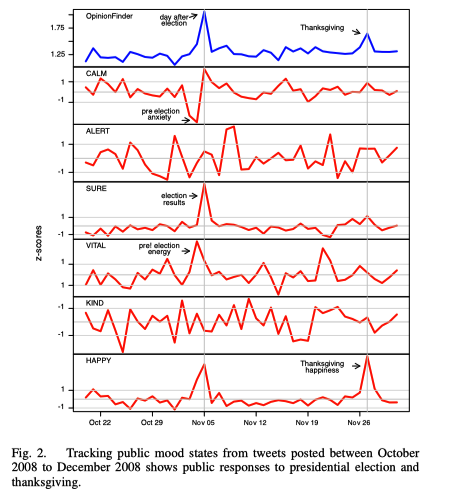
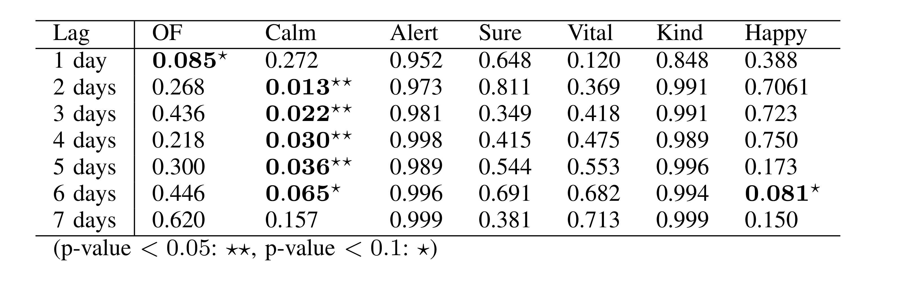
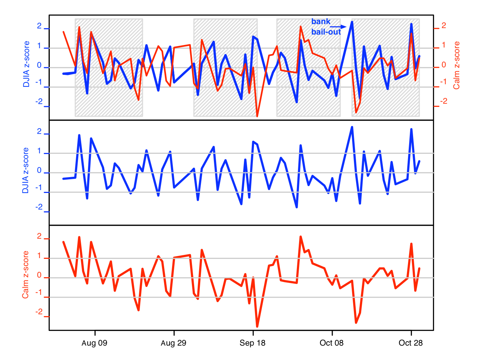
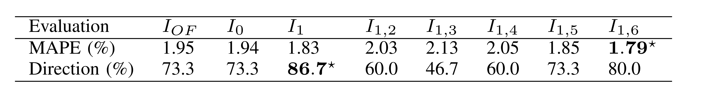
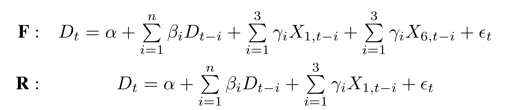

class: inverse, center, middle

# I. Introduction
```{r, echo = FALSE, message=FALSE}
if (!require("pacman")) install.packages("pacman")
pacman::p_load(tidyverse, tidymodels)
```
---

class: center, middle

# Paper

[Twitter mood predicts the stock market](https://arxiv.org/abs/1010.3003) by Johan Bollen, Huina Mao, Xiao-Jun Zeng

---

# Introduction

- previously, random walk + Efficient Market Hypothesis (EMH)
  - content: stock prices -> driven by new information (rather than past and present prices)
  - issues: (1) not a random walk; (2) news unpredictable, but very early indicators from social media can be extracted
- news does impact stock market prices, but public mood states might be just equally important, but **HOW**?
- public mood **data sources**: blog content, **large-scale Twitter feeds**, etc.

--

## Analysis

1. OpinionFinder (+/- mood)
2. Google-Profile of Mood States (GPOMS) (6-dim mood measures)
  - **Calm, Alert, Sure, Vital, Kind, and Happy**
  
---

# Introduction

## Method

Granger causality analysis and a Self-Organizing Fuzzy Neural Network

## Findings

- improved prediction accuracy of Dow Jones Industrial Average (DJIA) by the inclusion of public mood dimensions
- public mood states are predictive of changes in DJIA closing values
- Calm and Happiness by GPOMS seem to have a predictive effect, but not general happiness by OpinionFinder.

---

class: inverse, center, middle

# II. Background Knowledge

---

# Granger Causality Analysis

Lorem ipsum dolor sit amet, consectetur adipiscing elit, sed do eiusmod tempor incididunt ut labore et dolore magna aliqua. Ut enim ad minim veniam, quis nostrud exercitation ullamco laboris nisi ut aliquip ex ea commodo consequat. Duis aute irure dolor in reprehenderit in voluptate velit esse cillum dolore eu fugiat nulla pariatur. Excepteur sint occaecat cupidatat non proident, sunt in culpa qui officia deserunt mollit anim id est laborum.

---

# Self-Organizing Fuzzy Neural Network (SOFNN)

Lorem ipsum dolor sit amet, consectetur adipiscing elit, sed do eiusmod tempor incididunt ut labore et dolore magna aliqua. Ut enim ad minim veniam, quis nostrud exercitation ullamco laboris nisi ut aliquip ex ea commodo consequat. Duis aute irure dolor in reprehenderit in voluptate velit esse cillum dolore eu fugiat nulla pariatur. Excepteur sint occaecat cupidatat non proident, sunt in culpa qui officia deserunt mollit anim id est laborum.

---

class: inverse, center, middle

# III. Results - Data and Methods

---

# Data and Methods

- 9.8M tweets from 2.7M users
- cleaned by
  - removing stop-words and punctuation
  - grouping by date (unified timezone)
  - filtering by explicit mood states ("i am feeling", "i don't feel", "I'm", etc.)
- 3 phases
  - 1st phase: generate 7 (1 + 6) mood time series and 1 DJIA closing-value time series
  - 2nd phase: hypothesis testing that the 7-dim mood is predictive of future DJIA values; with a Granger causality analysis in which we correlate DJIA values to GPOMS and OF values of the past $n$ days
  - 3rd phase: deploy a Self-Organizing Fuzzy Neural Network to test the hypothesis that the prediction accuracy of DJIA can be improved by including the mood measurements

---

class: inverse, center, middle

# III. Results - Public Mood Time Series Generation

---

# Public Mood Time Series Generation

- OpinionFinder (OF), [link](https://mpqa.cs.pitt.edu/opinionfinder/)
  - identifies the emotional polarity (+/-) of sentences
  - adapt the OF's subjective lexicon from previous studies, select both positive and negative words, marked as either "weak" and "strong"
  - use the occurrences of +/- words to score the tweet and collectively score the day by aggregating all tweets on the same day
- GPOMS
  - 6 dimensions, 6 moods
    - *Calm, Alert, Sure, Vital, Kind* and *Happy*.
    - dimensions and lexicon derived from existing psychometric instrument Profile of Mood State (POMS-bi)
  - Google apparently utilizes its computational power and exposure to immense amount of text data to fine tune the model
  - tweet -> POMS mood dimensions (quite complex here mapping back and forth, but eventually) -> a score which is the weighted sum of the co-occurrence weights of each tweet term that matched the GPOMS lexicon
- comparison between GPOMS and OF: normalization to z-score (with a moving 2k days' average) (See the formula)

---

class: inverse, center, middle

# III. Results - Cross-validation

---

# Cross-validation

Cross-validating against socio-cultural events

- Test run on U.S. presidential election and Thanksgiving
- Visual inspection -> *Happy* approximates the OF's results -> MLR to quantify such relationship (`Y_OF` vs `X_GPOMS`)

---

# Cross-validation



---

# Cross-validation



---

class: inverse, center, middle

# III. Results - Bivariate Granger Causality Analysis

---

# Bivariate Granger Causality Analysis

**Mood vs. DJIA prices**

- Granger causality analysis: daily time series vs the DJIA
- Recall the assumption: if a variable X causes Y then changes in X will systematically occur before changes in Y -> the lagged values of X will exhibit a statistically significant correlation with Y
- It's not a direct proof of causality. It's only testing if one time series has predictive information about the other.
- two models `L_1` and `L_2` (excluding exceptional public mood response)
  - `L_1`: only n lagged values of DJIA: $D_t = \alpha + \sum_{i=1}^{n} \beta_iD_{t-1}$
  - `L_2`: n lagged values + GPOMS + OF mood time series: $D_t = \alpha + \sum_{i=1}^{n} \beta_iD_{t-i} + \sum_{i=1}^{n} \gamma_iX_{t-i} + err_t$
- $D_t = D_t - D_{t-1}$

---
# Bivariate Granger Causality Analysis

- Interpret the result table
  


---
# Bivariate Granger Causality Analysis

- Interpret the overlapping plots together (same directions, etc.)
   

---

class: inverse, center, middle

# III. Nonlinear Models for Emotion-based Stock Prediction

---

# SOFNN

- Granger causality analysis is based on linear regression. This is too ideal, almost certainly not linear.
- So here we introduce another approach, the Self-Organizing Fuzzy Neural Network (SOFNN), which has 2 inputs:
  -the past 3 days of DJIA
  -the same combined with various permutations of our mood time series

- $I_0 = \{DJIA_{t-3,2,1}\}$
- $I_1 = \{DJIA_{t-3,2,1}, X_{1,t-3,2,1}\}$
- $I_{1,2} = \{DJIA_{t-3,2,1}, X_{1,t-3,2,1},X_{2,t-3,2,1}\}$
- $X_{i,t-3,2,1}$: GPOMS/OF mood of dimension i at time t-1, t-2,t-3.
- see if SOFNN confirms or rejects the null hypothesis that public mood does not improve predictive models of DJIA
- model came from a previous study, `n` days of DJIA, `n=3` since `n=4` the Granger causality between *Calm* and DJIA decreases.

---

# SOFNN

- result2: previous one is about the mood dimensions of GPOMS, what about OF? Solely use SOFNN with OF (Table III for the performance)
  
  - MAPE: Mean Absolute Percentage Error
  - direction accuracy: correctness of up/down prediction
  - (1)only *Calm* (and to some degree *Happy*) is Granger-causative of DJIA, but others combined could be informative as well.
  - (2) adding OF has no effect on prediction accuracy compared to using only historical DJIA
  - (3) adding $I_1$ (*Calm*), the prediction accuracy is the highest
  - (4) $I_{1,3}$ and $I_{1,4}$ (*Calm* + *Sure* and *Calm* + *Vital*) reduce the accuracy

---

# SOFNN
  
- last check: test the linear effect of *Calm* and *Happy*
 - $D_t = \alpha + \sum_{i=1}^{n} \beta_iD_{t-i} + \sum_{i=1}^{n} \gamma_iX_{1,t-i} + \sum_{i=1}^{n} \gamma_iX_{6,t-i} + err_t$
 - F-statistics of 0.53 and p-value of 0.66 indicates that a linear combination of $X_1, X_6$ produce worse results than $X_1$ alone
 - However, SOFNN prediction is more accurate when using combination of $X_1,X_6$
 - Confirm a nonlinear relation among the different dimensions of moods.



---

class: inverse, center, middle

# IV. Discussion

---

# Discussion

- The last paragraph does have some insights on the drawbacks of this experiment.
  - (1) not limited to a geolocation, or a population subset (because DJIA is for US stock market)
  - (2) no ground truth about Twitter's tweets and the real public mood states, just one perspective
  - (3) still hints for strong correlation between the two, but offers nothing substantial about the causality
- no evidence for relation between people who invest and people who use Twitter
- maybe the general public at that moment are all financial experts who strongly invested in DJIA, therefore their mood states will affect their investment decisions -> stock market prices (no one could know this)

---

class: inverse, center, middle

# V. Demo

---

# Demo

It's very hard to replicate the experiment since the main website of that project is down. Think about it, it's rather hard to acquire large-scale data today to reflect a collective public mood state. But we can do it from an opposite direction, namely, we get some specific high-level metric, and see if it is predictive of its followers' mood states.

This is almost certain since the followers will react to what they are following no matter what, unless they are no longer followers. For example, we get stock prices of a stock, then we see if the rise and fall of that stock is reflected in a subreddit's collective sentimental changes.

---

# Sentiment Lexicons

The `tidytext` package provides access to several sentiment lexicons. Three general-purpose lexicons are

- AFINN from [Finn Årup Nielsen](http://www2.imm.dtu.dk/pubdb/pubs/6010-full.html)
  - assigns words with a score that runs between -5 and 5, with negative scores indicating negative sentiment and positive scores indicating positive sentiment.
- bing from [Bing Liu and collaborators](https://www.cs.uic.edu/~liub/FBS/sentiment-analysis.html)
  - categorizes words in a binary fashion into positive and negative categories.
- nrc from [Saif Mohammad and Peter Turney](http://saifmohammad.com/WebPages/NRC-Emotion-Lexicon.htm).
  - categorizes words in a binary fashion (“yes”/“no”) into categories of positive, negative, anger, anticipation, disgust, fear, joy, sadness, surprise, and trust.

---

# mood.r


[script](djia-vs-reddit/mood.R)

---

class: inverse, center, middle

# VI. ¿Question time?

---
class: center, middle

# Thanks!

Scripts and slides used in the presentation are available on GitHub: <br /> [**https://github.com/rexarski/case-study-twitter-mood-stock**](https://github.com/rexarski/case-study-twitter-mood-stock).

Slides created via the R package [**xaringan**](https://github.com/yihui/xaringan).

The chakra comes from [remark.js](https://remarkjs.com), [knitr](https://yihui.org/knitr/), and [R Markdown](https://rmarkdown.rstudio.com).
